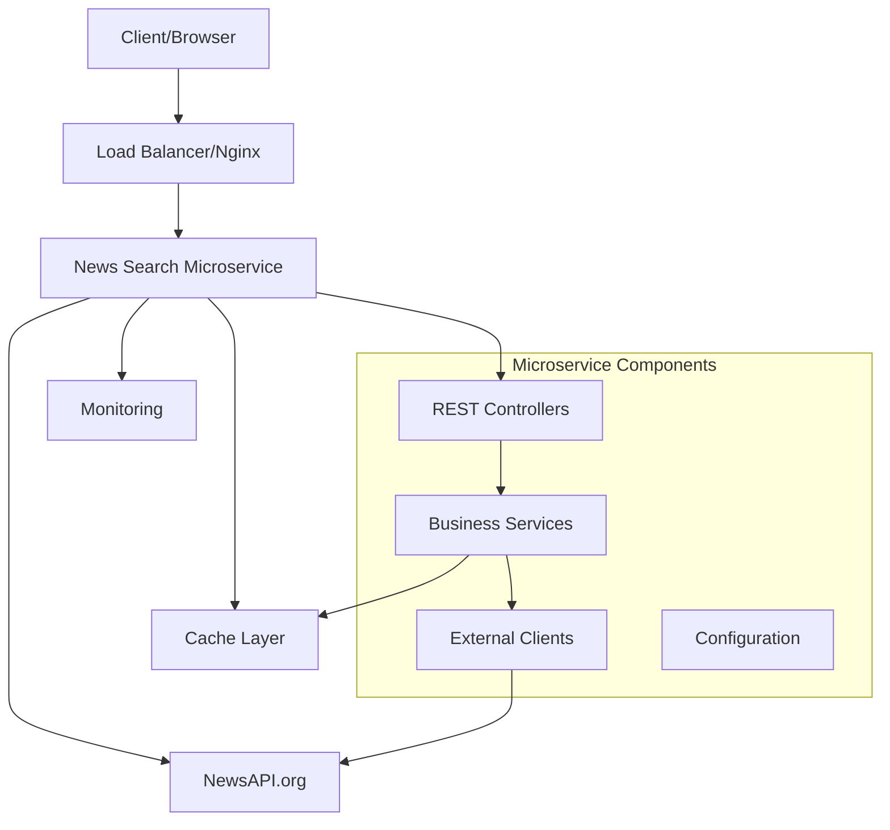

# News Search Microservice

[](https://jenkins.example.com/job/news-search-microservice/)
[](https://sonarqube.example.com/dashboard?id=news-search-microservice)
[](https://sonarqube.example.com/dashboard?id=news-search-microservice)
[](https://hub.docker.com/r/newsservice/news-search-microservice)

A production-ready microservice for searching and grouping news articles with intelligent time-based categorization, offline mode support, and comprehensive monitoring capabilities.

## 🚀 Features

- **News Search**: Search news articles using NewsAPI.org with keyword-based queries
- **Time-based Grouping**: Automatically group results by customizable time intervals (minutes, hours, days, weeks, months, years)
- **Offline Mode**: Intelligent fallback with caching when external APIs are unavailable
- **HATEOAS Compliance**: RESTful API with hypermedia controls for better discoverability
- **Production Ready**: Comprehensive monitoring, security, and performance optimizations
- **Modern UI**: Responsive React-based frontend with real-time search capabilities
- **Comprehensive Testing**: Unit, integration, and BDD tests with high coverage
- **Container Ready**: Docker support with multi-stage builds and security best practices

## 🏗️ Architecture

### System Architecture



### Design Patterns Used

1. **SOLID Principles**
   - **Single Responsibility**: Each service class has a single, well-defined purpose
   - **Open/Closed**: Extensible through interfaces without modifying existing code
   - **Liskov Substitution**: Proper inheritance hierarchies with substitutable implementations
   - **Interface Segregation**: Focused interfaces for specific functionalities
   - **Dependency Inversion**: Dependency injection with Spring Framework

2. **12-Factor App Principles**
   - **Codebase**: Single codebase tracked in version control
   - **Dependencies**: Explicit dependency declaration via Maven
   - **Config**: Configuration stored in environment variables
   - **Backing Services**: External APIs treated as attached resources
   - **Build/Release/Run**: Strict separation of build and run stages
   - **Processes**: Stateless processes with shared-nothing architecture
   - **Port Binding**: Self-contained service binding to port 8080
   - **Concurrency**: Horizontal scaling through process model
   - **Disposability**: Fast startup and graceful shutdown
   - **Dev/Prod Parity**: Development and production environments kept similar
   - **Logs**: Treat logs as event streams
   - **Admin Processes**: Administrative tasks run as one-off processes

3. **Additional Patterns**
   - **Repository Pattern**: Data access abstraction
   - **Strategy Pattern**: Different time interval grouping strategies
   - **Circuit Breaker**: Fault tolerance for external API calls
   - **Cache-Aside**: Caching strategy for offline mode
   - **Builder Pattern**: Complex object construction
   - **Factory Pattern**: Time interval parsing and creation

## 🛠️ Technology Stack

### Backend
- **Java 17**: Modern Java with latest features
- **Spring Boot 3.2.0**: Production-ready framework with auto-configuration
- **Spring WebFlux**: Reactive programming for better performance
- **Spring Security**: Comprehensive security framework
- **Spring Cache**: Caching abstraction with Caffeine
- **Maven**: Dependency management and build automation

### Frontend
- **HTML5/CSS3**: Modern web standards
- **JavaScript ES6+**: Modern JavaScript features
- **Bootstrap 5**: Responsive UI framework
- **Font Awesome**: Icon library

### Infrastructure
- **Docker**: Containerization with multi-stage builds
- **Docker Compose**: Multi-container orchestration
- **Jenkins**: CI/CD pipeline automation
- **Nginx**: Reverse proxy and load balancing
- **Prometheus**: Metrics collection
- **Grafana**: Monitoring dashboards

### Testing
- **JUnit 5**: Unit testing framework
- **Mockito**: Mocking framework
- **Spring Boot Test**: Integration testing
- **Cucumber**: Behavior-driven development
- **WireMock**: API mocking for tests
- **JaCoCo**: Code coverage analysis

## 🚦 Getting Started

### Prerequisites

- Java 17 or higher
- Maven 3.6 or higher
- Docker and Docker Compose (for containerized deployment)
- NewsAPI.org API key (provided: `ccaf5d41cc5140c984818c344edcc14d`)

### Local Development

1. **Clone the repository**
   ```bash
   git clone https://github.com/newsservice/news-search-microservice.git
   cd news-search-microservice
   ```

2. **Set environment variables**
   ```bash
   export NEWS_API_KEY=ccaf5d41cc5140c984818c344edcc14d
   ```

3. **Build the application**
   ```bash
   mvn clean compile
   ```

4. **Run tests**
   ```bash
   mvn test
   ```

5. **Start the application**
   ```bash
   mvn spring-boot:run
   ```

6. **Access the application**
   - Web UI: http://localhost:8080
   - API Documentation: http://localhost:8080/swagger-ui.html
   - Health Check: http://localhost:8080/api/v1/news/health

### Docker Deployment

1. **Build and run with Docker Compose**
   ```bash
   docker-compose up --build
   ```

2. **Access the application**
   - Application: http://localhost:8080
   - Monitoring: http://localhost:3000 (Grafana)
   - Metrics: http://localhost:9090 (Prometheus)

## 📚 API Documentation

### Base URL
```
http://localhost:8080/api/v1/news
```

### Endpoints

#### Search News Articles
```http
GET /search?keyword={keyword}&intervalValue={value}&intervalUnit={unit}&offlineMode={boolean}
```

**Parameters:**
- `keyword` (required): Search keyword (e.g., "apple", "technology")
- `intervalValue` (optional): Number of time units (default: 12)
- `intervalUnit` (optional): Time unit - minutes, hours, days, weeks, months, years (default: hours)
- `offlineMode` (optional): Enable offline mode (default: false)

**Example Request:**
```bash
curl "http://localhost:8080/api/v1/news/search?keyword=apple&intervalValue=6&intervalUnit=hours"
```

**Example Response:**
```json
{
  "keyword": "apple",
  "intervalValue": 6,
  "intervalUnit": "HOURS",
  "searchTimestamp": "2024-01-15T10:30:00",
  "fromCache": false,
  "totalArticles": 25,
  "intervalGroups": {
    "Last 6 hours (Jan 15 04:30 - 10:30)": {
      "intervalLabel": "Last 6 hours (Jan 15 04:30 - 10:30)",
      "count": 15,
      "startTime": "2024-01-15T04:30:00",
      "endTime": "2024-01-15T10:30:00",
      "articles": [...]
    }
  },
  "status": "success",
  "message": "Results fetched from NewsAPI",
  "_links": {
    "self": {
      "href": "http://localhost:8080/api/v1/news/search?keyword=apple&intervalValue=6&intervalUnit=hours"
    },
    "health": {
      "href": "http://localhost:8080/api/v1/news/health"
    }
  }
}
```

#### Health Check
```http
GET /health
```

#### Cache Statistics
```http
GET /cache/stats
```

#### Clear Cache
```http
DELETE /cache
```

#### API Information
```http
GET /info
```

### Error Responses

All error responses follow a consistent format:

```json
{
  "errorCode": "VALIDATION_ERROR",
  "message": "Request validation failed",
  "details": {
    "keyword": "Keyword is required"
  },
  "timestamp": "2024-01-15T10:30:00",
  "_links": {
    "api-info": {
      "href": "http://localhost:8080/api/v1/news/info"
    }
  }
}
```

## 🔧 Configuration

### Application Properties

The application supports multiple configuration profiles:

#### Development (`application-dev.yml`)
```yaml
news-api:
  api-key: ${NEWS_API_KEY:ccaf5d41cc5140c984818c344edcc14d}
  timeout: 30s
  retry-attempts: 3

offline-mode:
  enabled: false
  cache-duration: 24h
```

#### Production (`application-prod.yml`)
```yaml
news-api:
  api-key: ${NEWS_API_KEY}
  timeout: 10s
  retry-attempts: 2

offline-mode:
  enabled: true
  cache-duration: 6h
```

### Environment Variables

| Variable | Description | Default |
|----------|-------------|---------|
| `NEWS_API_KEY` | NewsAPI.org API key | `ccaf5d41cc5140c984818c344edcc14d` |
| `SPRING_PROFILES_ACTIVE` | Active Spring profile | `dev` |
| `SERVER_PORT` | Server port | `8080` |
| `JAVA_OPTS` | JVM options | `-Xmx512m -Xms256m` |

## 🧪 Testing

### Running Tests

```bash
# Unit tests
mvn test

# Integration tests
mvn verify

# BDD tests
mvn test -Dtest=CucumberTestRunner

# All tests with coverage
mvn clean verify
```

### Test Coverage

The project maintains high test coverage:
- Unit Tests: >90%
- Integration Tests: >80%
- BDD Tests: All major user scenarios

### Test Categories

1. **Unit Tests**: Test individual components in isolation
2. **Integration Tests**: Test component interactions
3. **BDD Tests**: Test user scenarios and business requirements
4. **Performance Tests**: Load and stress testing
5. **Security Tests**: Vulnerability scanning

## 🔒 Security

### Security Features

1. **API Key Protection**: Secure handling of external API keys
2. **Input Validation**: Comprehensive request validation
3. **Security Headers**: OWASP recommended security headers
4. **HTTPS Support**: TLS encryption for production
5. **Rate Limiting**: Protection against abuse
6. **Dependency Scanning**: Regular security vulnerability checks

### Security Headers

The application automatically adds security headers:
- `X-Content-Type-Options: nosniff`
- `X-XSS-Protection: 1; mode=block`
- `X-Frame-Options: DENY`
- `Strict-Transport-Security: max-age=31536000; includeSubDomains`
- `Referrer-Policy: strict-origin-when-cross-origin`

## 📊 Monitoring and Observability

### Health Checks

The application provides comprehensive health checks:
- Application health
- External API availability
- Cache status
- System metrics

### Metrics

Exposed metrics include:
- Request count and duration
- Cache hit/miss ratios
- External API response times
- JVM metrics
- Custom business metrics

### Logging

Structured logging with different levels:
- `ERROR`: System errors and exceptions
- `WARN`: Warning conditions
- `INFO`: General information
- `DEBUG`: Detailed debugging information

## 🚀 Deployment

### Docker Deployment

1. **Build Docker image**
   ```bash
   docker build -t news-search-microservice:latest .
   ```

2. **Run container**
   ```bash
   docker run -p 8080:8080 -e NEWS_API_KEY=your-api-key news-search-microservice:latest
   ```

### Kubernetes Deployment

```yaml
apiVersion: apps/v1
kind: Deployment
metadata:
  name: news-search-microservice
spec:
  replicas: 3
  selector:
    matchLabels:
      app: news-search-microservice
  template:
    metadata:
      labels:
        app: news-search-microservice
    spec:
      containers:
      - name: news-search-microservice
        image: news-search-microservice:latest
        ports:
        - containerPort: 8080
        env:
        - name: NEWS_API_KEY
          valueFrom:
            secretKeyRef:
              name: news-api-secret
              key: api-key
```

### CI/CD Pipeline

The Jenkins pipeline includes:
1. **Build**: Compile and package
2. **Test**: Unit, integration, and BDD tests
3. **Quality**: Code quality and security scans
4. **Package**: Docker image creation
5. **Deploy**: Automated deployment to staging/production
6. **Monitor**: Post-deployment verification

## 🤝 Contributing

1. Fork the repository
2. Create a feature branch (`git checkout -b feature/amazing-feature`)
3. Commit your changes (`git commit -m 'Add amazing feature'`)
4. Push to the branch (`git push origin feature/amazing-feature`)
5. Open a Pull Request

### Development Guidelines

- Follow SOLID principles
- Write comprehensive tests
- Update documentation
- Follow conventional commits
- Ensure security best practices

## 📄 License

This project is licensed under the MIT License - see the [LICENSE](LICENSE) file for details.

## 🆘 Support

- **Documentation**: [Wiki](https://github.com/newsservice/news-search-microservice/wiki)
- **Issues**: [GitHub Issues](https://github.com/newsservice/news-search-microservice/issues)
- **Discussions**: [GitHub Discussions](https://github.com/newsservice/news-search-microservice/discussions)
- **Email**: support@newsservice.com

## 🙏 Acknowledgments

- [NewsAPI.org](https://newsapi.org/) for providing the news data API
- [Spring Boot](https://spring.io/projects/spring-boot) for the excellent framework
- [Bootstrap](https://getbootstrap.com/) for the responsive UI components
- All contributors who helped make this project better

---

**Built with ❤️ by the News Service Team**
